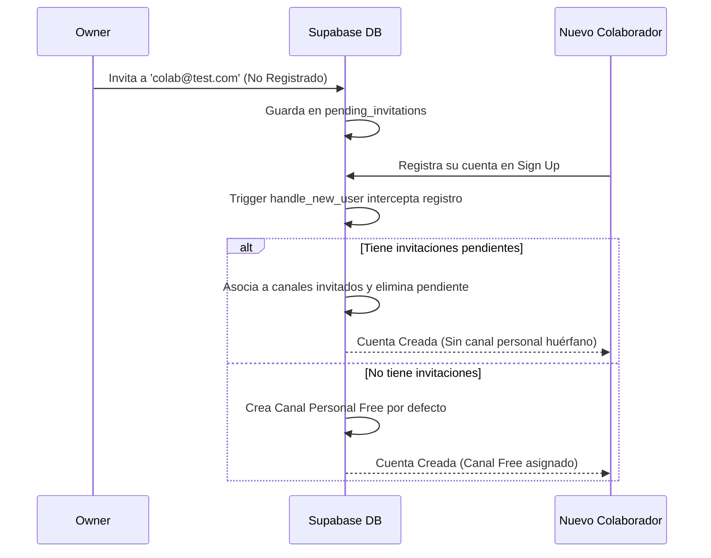

# 📘 MANUAL MAESTRO DE ARQUITECTURA Y DESPLIEGUE SAAS
## Atesur Channel Editor v4 — Multitenancy, Seguridad & HWID

Este manual describe detalladamente el diseño arquitectónico, el modelo de datos relacional y de seguridad, la gestión autónoma de colaboradores libre de bloatware, el blindaje de hardware (HWID) y las mejores prácticas para compilar y desplegar compilaciones de producción altamente seguras contra ingeniería inversa.

---

## 🎨 1. Arquitectura SaaS Multi-Canal (Multi-Tenancy)

La plataforma Atesur opera bajo un modelo **SaaS Single-Tenant Database / Multi-Tenant Client**. Todas las operaciones del negocio residen en una única base de datos aislada a nivel de fila (RLS) en Supabase. El software adapta su interfaz y sus recursos dinámicamente según la identidad del canal seleccionado al iniciar sesión.

```mermaid
flowchart TD
    A[Usuario Logueado] --> B{activeChannelProvider}
    B -->|Usuario Invitado (Canal Activo)| C[Canal de Pago / Trial Activo]
    B -->|Usuario Nuevo Individual| D[Canal Personal Free]
    C --> E[Bypass de Bloqueo: Acceso Editor]
    D --> F[ActivationGateScreen - Requiere Serial]
```

### 1.1 Resolución Dinámica de Canal
* **Aplicación Móvil**: Lee el identificador del paquete (Package Name) de Android de forma dinámica y filtra los contenidos (streamings, configuraciones de WordPress) de ese canal específico.
* **Sitio Web**: Detecta el origen HTTP (dominio del host) y extrae las configuraciones vinculadas.
* **Editor de Escritorio (Windows)**: Carga las membresías de los canales del usuario utilizando la tabla relacional `channel_users`.

### 1.2 Priorización Inteligente en Login (Bypass del Activation Gate)
* **El Problema**: Cuando un colaborador es invitado por un Owner a un canal Pro o de pago, al registrarse se le crea simultáneamente su canal personal Free (inactivo). Si el proveedor del canal activo selecciona el primer canal por orden de creación, el colaborador queda atrapado en la pantalla `ActivationGateScreen` de su canal inactivo, impidiéndole operar en el canal del Owner.
* **La Solución**: El proveedor de estado `activeChannelProvider` implementa un algoritmo de priorización reactiva en frío al loguearse:
  1. Consulta todas las membresías del usuario en `channel_users`.
  2. Si el usuario pertenece a múltiples canales, realiza un cruce rápido con `channel_subscriptions`.
  3. **Establece automáticamente como canal activo** el primer canal que cuente con una suscripción o período de prueba (Trial) con estado `active` o `trialing`.
  4. Solo si todos sus canales asociados son del plan `Free`, selecciona su canal personal.

---

## 👥 2. Gestión Autónoma de Equipos (Zero-Bloat Workflow)

El sistema de gestión de colaboradores permite que el Propietario (Owner) y los Administradores (Admins) autogestionen a su personal de forma descentralizada. Se restringe el acceso según jerarquías estrictas y se controlan los límites del plan de suscripción contratado.

### 2.1 Flujo de Invitación Pre-Signup sin "Database Bloat"
Para evitar que la base de datos se llene de registros huérfanos y canales vacíos creados por colaboradores invitados que no culminan su registro, implementamos el flujo **Zero-Bloat**:

1. El Owner/Admin envía una invitación ingresando un correo electrónico en la pestaña de Equipo.
2. Si el correo **ya existe** en la base de datos: Se asocia de inmediato al canal en `channel_users`.
3. Si el correo **no existe** en la base de datos: Se almacena en la tabla segura `pending_invitations`.
4. Al completarse el registro en el Sign Up de la app, el disparador (Trigger) `handle_new_user` intercepta el correo:
   - Si detecta invitaciones en `pending_invitations`, asocia al usuario a dichos canales y **suprime la creación de su canal personal Free por defecto**.
   - Si no existen invitaciones, crea su canal Free personal normal.



### 2.2 Jerarquías y Reglas de Roles
Las operaciones de administración de miembros se rigen por la siguiente matriz de permisos y jerarquía en caliente:

| Rol del Operador | Acciones Permitidas | Restricciones Jerárquicas |
| :--- | :--- | :--- |
| **Owner** (Propietario) | Gestionar todo el canal, invitar y remover a cualquier miembro. | No puede eliminarse a sí mismo (debe transferir propiedad o dar de baja el canal). |
| **Admin** (Administrador) | Invitar y eliminar Editores y Viewers. | No puede invitar a otros Admins. No puede ver ni eliminar al Owner ni a otros Admins. |
| **Editor** (Colaborador) | Modificar contenidos (programas, películas, publicidades). | No tiene acceso a la pestaña de "Equipo" ni a configuraciones de suscripción. |
| **Viewer** (Espectador) | Solo lectura del planificador de transmisiones y bases de datos. | Sin permisos de modificación. |

---

## 🛡️ 3. Blindaje de Hardware (HWID) y Prevención de Abuso de Trials

Para evitar pérdidas financieras donde usuarios avanzados abusan de períodos de prueba ("Pro Trial") sucesivos borrando carpetas locales u ocultando configuraciones, implementamos una huella digital criptográfica inalterable ligada a componentes físicos.

### 3.1 Firmas Físicas de Placa Base y BIOS
En Windows Desktop, la aplicación ejecuta llamadas de bajo nivel al sistema para extraer firmas físicas inmutables de los chips integrados:
1. **Motherboard UUID**: Identificador universal y físico del producto placa base (`wmic csproduct get uuid`).
2. **BIOS Serial Number**: Número de serie grabado de fábrica por el ensamblador en el BIOS (`wmic bios get serialnumber`).

### 3.2 Hasheo SHA-256 Silencioso
Ambas firmas se limpian de espacios en blanco, se concatenan internamente mediante un prefijo estricto y se hashean mediante **SHA-256** utilizando la biblioteca criptográfica nativa de Dart. El HWID resultante es robusto y estable ante formateos del sistema operativo, reemplazos de disco duro o purga de directorios.

```dart
// Implementación en lib/core/services/device_info_service.dart
Future<String> _getWindowsHardwareId() async {
  try {
    final uuidResult = await Process.run('wmic', ['csproduct', 'get', 'uuid']);
    String uuid = '';
    if (uuidResult.exitCode == 0) {
      uuid = uuidResult.stdout.toString().replaceFirst('UUID', '').trim();
    }

    final biosResult = await Process.run('wmic', ['bios', 'get', 'serialnumber']);
    String biosSerial = '';
    if (biosResult.exitCode == 0) {
      biosSerial = biosResult.stdout.toString().replaceFirst('SerialNumber', '').trim();
    }

    if (uuid.isNotEmpty && 
        uuid.toUpperCase() != 'FFFFFFFF-FFFF-FFFF-FFFF-FFFFFFFFFFFF' &&
        !uuid.toLowerCase().contains('not available')) {
      
      final rawSignature = 'WIN-HW-$uuid-$biosSerial';
      final bytes = utf8.encode(rawSignature);
      final digest = sha256.convert(bytes);
      return digest.toString(); // Hash SHA-256 blindado
    }
  } catch (e) {
    debugPrint('Error obteniendo firmas físicas de Windows: $e');
  }
  return '';
}
```

### 3.3 Blindaje contra "Sniffing" y Manipulación Externa
* **Sin filtración en correos electrónicos**: El HWID físico **nunca** es expuesto ni enviado en los correos de solicitud de serial dirigidos a soporte. Esto evita que atacantes externos intercepten o intenten simular (spoofing) un hardware falsificado.
* **Túnel HTTPS Seguro**: La validación se produce de forma silenciosa. Al ingresar el serial en el software, este envía el HWID físico directamente como parámetro al procedimiento seguro de la base de datos `activate_license_key(p_key_code, p_channel_id, p_device_id, p_device_name)`.
- Si el serial es de tipo **Pro Trial** y el HWID ya fue registrado consumiendo un trial en cualquier canal anterior, la activación se aborta devolviendo un mensaje amigable pero inexpugnable.
- Si el serial es un plan de pago directo, el dispositivo se vincula y actualiza la licencia del canal sin restricción alguna.

---

## 🗄️ 4. Modelo de Datos y Schemas en Supabase (DDL)

A continuación, se detalla la base relacional del SaaS multi-inquilino. Estos scripts de DDL de Postgres configuran las tablas de almacenamiento físico, restricciones de integridad referencial y las funciones críticas.

### 4.1 Definición de Tablas Principales

```sql
-- Habilitar extensión UUID
CREATE EXTENSION IF NOT EXISTS "uuid-ossp";

-- 1. Tabla de Planes de Suscripción con Feature Flags y Límites cuantitativos
CREATE TABLE public.subscription_plans (
  id uuid PRIMARY KEY DEFAULT gen_random_uuid(),
  name text NOT NULL UNIQUE,
  max_channels integer DEFAULT 1 NOT NULL,
  max_movies_limit integer DEFAULT 20 NOT NULL,
  max_notifications_per_month integer DEFAULT 100 NOT NULL,
  max_devices_limit integer DEFAULT 1 NOT NULL,
  max_admins integer DEFAULT 0 NOT NULL,
  max_editors integer DEFAULT 0 NOT NULL,
  max_viewers integer DEFAULT 1 NOT NULL,
  trial_duration_days integer DEFAULT 14 NOT NULL,
  
  -- Feature Flags de la aplicación
  show_notifications boolean DEFAULT false NOT NULL,
  show_in_app_messages boolean DEFAULT false NOT NULL,
  show_web_advertising boolean DEFAULT false NOT NULL,
  show_program_schedule boolean DEFAULT true NOT NULL,
  show_ad_scheduler boolean DEFAULT false NOT NULL,
  show_vmix_titler boolean DEFAULT false NOT NULL,
  show_overlay_scheduler boolean DEFAULT false NOT NULL,
  show_movies_database boolean DEFAULT true NOT NULL,
  show_manual_scheduler boolean DEFAULT false NOT NULL,
  show_channel_settings boolean DEFAULT true NOT NULL,
  
  created_at timestamp with time zone DEFAULT timezone('utc'::text, now()) NOT NULL,
  updated_at timestamp with time zone DEFAULT timezone('utc'::text, now()) NOT NULL
);

-- 2. Tabla de Canales
CREATE TABLE public.channels (
  id uuid PRIMARY KEY DEFAULT gen_random_uuid(),
  name text NOT NULL,
  logo_url text,
  timezone text DEFAULT 'America/La_Paz' NOT NULL,
  android_package_name text,
  web_app_url text,
  vmix_host text DEFAULT 'localhost' NOT NULL,
  vmix_port integer DEFAULT 8088 NOT NULL,
  vmix_active_input_key text,
  created_at timestamp with time zone DEFAULT timezone('utc'::text, now()) NOT NULL,
  updated_at timestamp with time zone DEFAULT timezone('utc'::text, now()) NOT NULL
);

-- 3. Tabla de Relación de Usuarios y Canales (Asignación de Roles)
CREATE TABLE public.channel_users (
  id uuid PRIMARY KEY DEFAULT gen_random_uuid(),
  channel_id uuid REFERENCES public.channels(id) ON DELETE CASCADE NOT NULL,
  user_id uuid REFERENCES auth.users(id) ON DELETE CASCADE NOT NULL,
  role text DEFAULT 'editor' NOT NULL CHECK (role IN ('owner', 'admin', 'editor', 'viewer')),
  created_at timestamp with time zone DEFAULT timezone('utc'::text, now()) NOT NULL,
  UNIQUE (channel_id, user_id)
);

-- 4. Tabla de Suscripciones Activas
CREATE TABLE public.channel_subscriptions (
  id uuid PRIMARY KEY DEFAULT gen_random_uuid(),
  channel_id uuid REFERENCES public.channels(id) ON DELETE CASCADE NOT NULL UNIQUE,
  plan_id uuid REFERENCES public.subscription_plans(id) ON DELETE RESTRICT NOT NULL,
  billing_cycle text NOT NULL CHECK (billing_cycle IN ('monthly', 'yearly', 'lifetime')),
  status text DEFAULT 'active' NOT NULL CHECK (status IN ('active', 'past_due', 'canceled', 'trialing')),
  period_start timestamp with time zone,
  period_end timestamp with time zone,
  cancel_at_period_end boolean DEFAULT false NOT NULL,
  created_at timestamp with time zone DEFAULT timezone('utc'::text, now()) NOT NULL,
  updated_at timestamp with time zone DEFAULT timezone('utc'::text, now()) NOT NULL
);

-- 5. Tabla de Invitaciones Pendientes (Miembros pre-signup)
CREATE TABLE public.pending_invitations (
  id uuid PRIMARY KEY DEFAULT gen_random_uuid(),
  channel_id uuid REFERENCES public.channels(id) ON DELETE CASCADE NOT NULL,
  email text NOT NULL,
  role text NOT NULL CHECK (role IN ('admin', 'editor', 'viewer')),
  invited_by uuid NOT NULL,
  created_at timestamp with time zone DEFAULT timezone('utc'::text, now()) NOT NULL
);

-- 6. Tabla de Dispositivos Vinculados al Canal
CREATE TABLE public.channel_devices (
  id uuid PRIMARY KEY DEFAULT gen_random_uuid(),
  channel_id uuid REFERENCES public.channels(id) ON DELETE CASCADE NOT NULL,
  device_id text NOT NULL,
  device_name text NOT NULL,
  last_active_at timestamp with time zone DEFAULT timezone('utc'::text, now()) NOT NULL,
  created_at timestamp with time zone DEFAULT timezone('utc'::text, now()) NOT NULL
);

-- 7. Tabla de Claves de Licencia / Seriales
CREATE TABLE public.license_keys (
  id uuid PRIMARY KEY DEFAULT gen_random_uuid(),
  key_code text NOT NULL UNIQUE,
  plan_id uuid REFERENCES public.subscription_plans(id) ON DELETE RESTRICT NOT NULL,
  duration_days integer NOT NULL,
  is_used boolean DEFAULT false NOT NULL,
  used_by_channel_id uuid REFERENCES public.channels(id) ON DELETE SET NULL,
  used_at timestamp with time zone,
  activated_on_device_id text,
  activated_on_device_name text,
  created_at timestamp with time zone DEFAULT timezone('utc'::text, now()) NOT NULL
);

-- 8. Tabla de Super Administradores del Sistema
CREATE TABLE public.system_admins (
  user_id uuid PRIMARY KEY REFERENCES auth.users(id) ON DELETE CASCADE,
  created_at timestamp with time zone DEFAULT timezone('utc'::text, now()) NOT NULL
);
```

### 4.2 Políticas RLS Libres de Recursión (Seguridad Inmune)
> [!IMPORTANT]
> Nunca uses subconsultas recursivas a la tabla `channel_users` directamente en la política de `channel_users`. Esto produce bucles infinitos en PostgreSQL. En su lugar, usa funciones auxiliares declaradas con `SECURITY DEFINER` que ejecuten internamente con bypass de RLS.

```sql
-- 1. Helper: Comprobar Membresía
CREATE OR REPLACE FUNCTION public.is_channel_member(p_channel_id uuid, p_user_id uuid)
RETURNS boolean LANGUAGE plpgsql SECURITY DEFINER AS $$
BEGIN
  RETURN EXISTS (
    SELECT 1 FROM public.channel_users
    WHERE channel_id = p_channel_id AND user_id = p_user_id
  );
END;
$$;

-- 2. Helper: Comprobar Rango Administrativo
CREATE OR REPLACE FUNCTION public.is_channel_admin_or_owner(p_channel_id uuid, p_user_id uuid)
RETURNS boolean LANGUAGE plpgsql SECURITY DEFINER AS $$
BEGIN
  RETURN EXISTS (
    SELECT 1 FROM public.channel_users
    WHERE channel_id = p_channel_id AND user_id = p_user_id AND role IN ('owner', 'admin')
  );
END;
$$;

-- Habilitar RLS
ALTER TABLE public.channel_users ENABLE ROW LEVEL SECURITY;

-- 3. Políticas
DROP POLICY IF EXISTS "Miembros ven asignaciones del canal" ON public.channel_users;
CREATE POLICY "Miembros ven asignaciones del canal" ON public.channel_users
  FOR SELECT TO authenticated
  USING (public.is_channel_member(channel_id, auth.uid()));

DROP POLICY IF EXISTS "Owners/Admins gestionan miembros del canal" ON public.channel_users;
CREATE POLICY "Owners/Admins gestionan miembros del canal" ON public.channel_users
  FOR ALL TO authenticated
  USING (public.is_channel_admin_or_owner(channel_id, auth.uid()));
```

---

## ⚙️ 5. Procedimientos Almacenados y Lógica de Servidor (RPC)

Los RPC encapsulan la lógica de negocio compleja en transacciones atómicas controladas directamente en la base de datos PostgreSQL, garantizando la seguridad en el backend.

### 5.1 RPC: `invite_user_to_channel` (Invitaciones Reactivas)
Este procedimiento gestiona la adición inmediata de colaboradores (si ya tienen cuenta) o los añade a la lista de espera, validando los límites de su suscripción:

```sql
CREATE OR REPLACE FUNCTION public.invite_user_to_channel(p_email text, p_role text, p_active_channel_id uuid)
RETURNS jsonb AS $$
DECLARE
  v_inviter_id uuid;
  v_inviter_role text;
  v_target_user_id uuid;
  v_max_role_limit integer;
  v_current_role_count integer;
  v_current_pending_count integer;
  v_plan_name text;
  v_target_email text;
BEGIN
  -- 1. Verificar autenticación
  v_inviter_id := auth.uid();
  IF v_inviter_id IS NULL THEN
    RAISE EXCEPTION 'Usuario no autenticado.';
  END IF;

  -- 2. Validar rol del invitado
  IF p_role NOT IN ('admin', 'editor', 'viewer') THEN
    RAISE EXCEPTION 'Rol inválido. Los roles permitidos son: admin, editor, viewer.';
  END IF;

  -- 3. Obtener el rol del invitador en el canal
  SELECT role INTO v_inviter_role FROM public.channel_users
  WHERE channel_id = p_active_channel_id AND user_id = v_inviter_id;

  IF v_inviter_role IS NULL OR v_inviter_role NOT IN ('owner', 'admin') THEN
    RAISE EXCEPTION 'Acceso denegado: Solo el propietario (owner) o administradores del canal pueden gestionar miembros.';
  END IF;

  -- 4. Validar jerarquía de roles
  IF v_inviter_role = 'admin' AND p_role = 'admin' THEN
    RAISE EXCEPTION 'Acceso denegado: Un administrador no puede asignar otro administrador. Debe ser realizado por el Propietario (owner).';
  END IF;

  v_target_email := lower(trim(p_email));

  -- 5. Obtener los límites del plan para este rol específico
  SELECT 
    sp.name,
    CASE 
      WHEN p_role = 'admin' THEN sp.max_admins
      WHEN p_role = 'editor' THEN sp.max_editors
      WHEN p_role = 'viewer' THEN sp.max_viewers
      ELSE 0
    END INTO v_plan_name, v_max_role_limit
  FROM public.channel_subscriptions cs
  JOIN public.subscription_plans sp ON cs.plan_id = sp.id
  WHERE cs.channel_id = p_active_channel_id;

  -- Si no hay suscripción activa, se asume Plan Free por defecto
  IF v_max_role_limit IS NULL THEN
    SELECT 
      name,
      CASE 
        WHEN p_role = 'admin' THEN max_admins
        WHEN p_role = 'editor' THEN max_editors
        WHEN p_role = 'viewer' THEN max_viewers
        ELSE 0
      END INTO v_plan_name, v_max_role_limit
    FROM public.subscription_plans WHERE name = 'Free' LIMIT 1;
  END IF;

  -- 6. Contar cuántos usuarios del mismo rol ya existen en el canal (activos + pendientes)
  SELECT count(*) INTO v_current_role_count FROM public.channel_users
  WHERE channel_id = p_active_channel_id AND role = p_role;

  SELECT count(*) INTO v_current_pending_count FROM public.pending_invitations
  WHERE channel_id = p_active_channel_id AND role = p_role;

  -- 7. Validar límite
  IF (v_current_role_count + v_current_pending_count) >= v_max_role_limit THEN
    RAISE EXCEPTION 'Límite alcanzado: Tu plan actual (% ) solo permite un máximo de % usuario(s) con el rol de %.', v_plan_name, v_max_role_limit, p_role;
  END IF;

  -- 8. Buscar si el usuario ya está registrado en auth.users
  SELECT id INTO v_target_user_id FROM auth.users
  WHERE email = v_target_email LIMIT 1;

  IF v_target_user_id IS NOT NULL THEN
    -- Verificar si ya es miembro activo
    IF EXISTS (
      SELECT 1 FROM public.channel_users
      WHERE channel_id = p_active_channel_id AND user_id = v_target_user_id
    ) THEN
      RETURN jsonb_build_object('success', false, 'message', 'El usuario ya es miembro activo de este canal.');
    END IF;

    -- Agregar al miembro activo directamente
    INSERT INTO public.channel_users (channel_id, user_id, role)
    VALUES (p_active_channel_id, v_target_user_id, p_role);

    RETURN jsonb_build_object('success', true, 'message', '¡Usuario agregado al canal exitosamente!', 'status', 'active');
  ELSE
    -- Verificar si ya tiene invitación pendiente
    IF EXISTS (
      SELECT 1 FROM public.pending_invitations
      WHERE channel_id = p_active_channel_id AND email = v_target_email
    ) THEN
      RETURN jsonb_build_object('success', false, 'message', 'Este correo ya tiene una invitación pendiente para este canal.');
    END IF;

    -- Crear invitación pendiente
    INSERT INTO public.pending_invitations (channel_id, email, role, invited_by)
    VALUES (p_active_channel_id, v_target_email, p_role, v_inviter_id);

    RETURN jsonb_build_object('success', true, 'message', 'Invitación enviada de forma pendiente. Se agregará al registrarse.', 'status', 'pending');
  END IF;
END;
$$ LANGUAGE plpgsql SECURITY DEFINER;
```

### 5.2 RPC: `remove_user_from_channel` (Remoción Jerárquica)
Permite desvincular de forma segura a cualquier miembro validando la subordinación de roles:

```sql
CREATE OR REPLACE FUNCTION public.remove_user_from_channel(p_target_user_id uuid, p_active_channel_id uuid)
RETURNS boolean AS $$
DECLARE
  v_inviter_id uuid;
  v_inviter_role text;
  v_target_role text;
BEGIN
  -- 1. Verificar autenticación
  v_inviter_id := auth.uid();
  IF v_inviter_id IS NULL THEN
    RAISE EXCEPTION 'Usuario no autenticado.';
  END IF;

  -- 2. Obtener el rol del eliminador en el canal
  SELECT role INTO v_inviter_role FROM public.channel_users
  WHERE channel_id = p_active_channel_id AND user_id = v_inviter_id;

  IF v_inviter_role IS NULL OR v_inviter_role NOT IN ('owner', 'admin') THEN
    RAISE EXCEPTION 'Acceso denegado: Solo el propietario (owner) o administradores del canal pueden gestionar miembros.';
  END IF;

  -- 3. Obtener el rol del usuario objetivo en el canal
  SELECT role INTO v_target_role FROM public.channel_users
  WHERE channel_id = p_active_channel_id AND user_id = p_target_user_id;

  IF v_target_role IS NULL THEN
    RAISE EXCEPTION 'El usuario objetivo no es miembro de este canal.';
  END IF;

  -- 4. Validar jerarquía y protecciones especiales
  IF v_target_role = 'owner' THEN
    RAISE EXCEPTION 'Acceso denegado: No se puede eliminar al Propietario (owner) del canal.';
  END IF;

  IF v_inviter_role = 'admin' AND v_target_role = 'admin' THEN
    RAISE EXCEPTION 'Acceso denegado: Un administrador no puede eliminar a otro administrador.';
  END IF;

  -- 5. Proceder a la eliminación
  DELETE FROM public.channel_users
  WHERE channel_id = p_active_channel_id AND user_id = p_target_user_id;

  RETURN true;
END;
$$ LANGUAGE plpgsql SECURITY DEFINER;
```

### 5.3 RPC: `get_channel_members` (Resolución de Conflictos)
Retorna la lista ordenada de miembros resuelta de forma limpia ante variables de entorno gracias a `#variable_conflict use_column`:

```sql
CREATE OR REPLACE FUNCTION public.get_channel_members(p_channel_id uuid)
RETURNS TABLE (
  user_id uuid,
  email text,
  role text,
  created_at timestamp with time zone
) AS $$
#variable_conflict use_column
BEGIN
  -- 1. Verificar membresía o Super Admin
  IF NOT EXISTS (
    SELECT 1 FROM public.channel_users
    WHERE channel_id = p_channel_id AND user_id = auth.uid()
  ) THEN
    IF NOT public.is_super_admin() THEN
      RAISE EXCEPTION 'Acceso denegado: No eres miembro de este canal.';
    END IF;
  END IF;

  -- 2. Retornar miembros ordenados por jerarquía
  RETURN QUERY
  SELECT 
    cu.user_id,
    u.email::text,
    cu.role,
    cu.created_at
  FROM public.channel_users cu
  JOIN auth.users u ON cu.user_id = u.id
  WHERE cu.channel_id = p_channel_id
  ORDER BY 
    CASE cu.role
      WHEN 'owner' THEN 1
      WHEN 'admin' THEN 2
      WHEN 'editor' THEN 3
      WHEN 'viewer' THEN 4
      ELSE 5
    END,
    cu.created_at ASC;
END;
$$ LANGUAGE plpgsql SECURITY DEFINER;
```

### 5.4 Trigger: `handle_new_user` (Prevención de Bloat en Signup)
Se ejecuta de forma asíncrona tras la inserción en `auth.users`, enlazando las invitaciones y suprimiendo la base Free por defecto:

```sql
CREATE OR REPLACE FUNCTION public.handle_new_user()
RETURNS trigger AS $$
DECLARE
  new_channel_id uuid;
  free_plan_id uuid;
  v_has_pending_invites boolean;
  v_invite RECORD;
BEGIN
  -- Verificar si el nuevo correo tiene invitaciones pendientes
  SELECT EXISTS (
    SELECT 1 FROM public.pending_invitations 
    WHERE email = lower(trim(new.email))
  ) INTO v_has_pending_invites;

  IF v_has_pending_invites THEN
    -- Procesar cada invitación pendiente y agregar al usuario a esos canales
    FOR v_invite IN 
      SELECT channel_id, role FROM public.pending_invitations 
      WHERE email = lower(trim(new.email))
    LOOP
      INSERT INTO public.channel_users (channel_id, user_id, role)
      VALUES (v_invite.channel_id, new.id, v_invite.role);
    END LOOP;

    -- Eliminar las invitaciones pendientes procesadas
    DELETE FROM public.pending_invitations 
    WHERE email = lower(trim(new.email));
    
    -- ¡NO CREAR EL CANAL POR DEFECTO! (Ya que fue invitado a canales activos)
  ELSE
    -- Si no tiene invitaciones, crear el canal por defecto (Free inactivo)
    SELECT id INTO free_plan_id FROM public.subscription_plans WHERE name = 'Free' LIMIT 1;
    
    -- Crear canal dinámico para el nuevo usuario
    INSERT INTO public.channels (name)
    VALUES ('Canal de ' || split_part(new.email, '@', 1))
    RETURNING id INTO new_channel_id;
    
    -- Asociar al usuario como dueño (owner) de su canal
    INSERT INTO public.channel_users (channel_id, user_id, role)
    VALUES (new_channel_id, new.id, 'owner');
    
    -- Asignar una suscripción del plan Free por defecto
    INSERT INTO public.channel_subscriptions (channel_id, plan_id, billing_cycle, status, period_start, period_end)
    VALUES (new_channel_id, free_plan_id, 'monthly', 'active', now(), null);
    
    -- Crear configuración de canal por defecto
    INSERT INTO public.app_config (
      channel_id, stream_url, wordpress_url, logo_url,
      show_facebook, show_instagram, show_twitter, show_youtube, show_tiktok, show_whatsapp, show_email, show_website
    )
    VALUES (
      new_channel_id, 
      'https://video2.getstreamhosting.com:19360/chfabkvpur/chfabkvpur.m3u8',
      'https://atesurplus.wordpress.com/wp-json/wp/v2',
      null,
      true, true, true, true, true, true, true, true
    );
  END IF;
  
  RETURN new;
END;
$$ LANGUAGE plpgsql SECURITY DEFINER;
```

### 5.5 RPC: `activate_license_key` (Control de Fraude por HWID)
Este procedimiento gestiona la validación de claves en tiempo real, impidiendo la activación de múltiples triales en el mismo ordenador:

```sql
CREATE OR REPLACE FUNCTION public.activate_license_key(
  p_key_code text, 
  p_channel_id uuid, 
  p_device_id text, 
  p_device_name text
)
RETURNS jsonb AS $$
DECLARE
  v_plan_id uuid;
  v_plan_name text;
  v_duration_days integer;
  v_key_id uuid;
  v_is_used boolean;
  v_device_has_trial boolean;
BEGIN
  -- Buscar la clave de licencia y verificar que exista
  SELECT lk.id, lk.plan_id, lk.duration_days, lk.is_used, sp.name
  INTO v_key_id, v_plan_id, v_duration_days, v_is_used, v_plan_name
  FROM public.license_keys lk
  JOIN public.subscription_plans sp ON lk.plan_id = sp.id
  WHERE lk.key_code = p_key_code;
  
  IF v_key_id IS NULL THEN
    RETURN jsonb_build_object('success', false, 'message', 'La clave de licencia no es válida o no existe.');
  END IF;
  
  IF v_is_used THEN
    RETURN jsonb_build_object('success', false, 'message', 'Esta clave de licencia ya ha sido utilizada.');
  END IF;

  -- Si el serial a activar es un "Pro Trial", verificar si este equipo ya usó un trial anteriormente
  IF v_plan_name = 'Pro Trial' AND p_device_id IS NOT NULL THEN
    SELECT EXISTS (
      SELECT 1 FROM public.license_keys lk
      JOIN public.subscription_plans sp ON lk.plan_id = sp.id
      WHERE lk.activated_on_device_id = p_device_id AND sp.name = 'Pro Trial'
    ) INTO v_device_has_trial;

    IF v_device_has_trial THEN
      RETURN jsonb_build_object(
        'success', false, 
        'message', 'Límite de prueba alcanzado: Este equipo ya ha activado un periodo de prueba (Pro Trial) anteriormente. Para continuar utilizando el servicio, por favor adquiere una suscripción o plan de pago.'
      );
    END IF;
  END IF;
  
  -- Marcar el serial como usado y guardar huella del equipo
  UPDATE public.license_keys 
  SET 
    is_used = true, 
    used_by_channel_id = p_channel_id, 
    used_at = now(),
    activated_on_device_id = p_device_id,
    activated_on_device_name = p_device_name
  WHERE id = v_key_id;
  
  -- Crear o actualizar la suscripción del canal
  IF v_duration_days = -1 THEN
    -- Licencia de por vida (Lifetime)
    INSERT INTO public.channel_subscriptions (channel_id, plan_id, billing_cycle, status, period_start, period_end)
    VALUES (p_channel_id, v_plan_id, 'lifetime', 'active', now(), null)
    ON CONFLICT (channel_id) DO UPDATE SET
      plan_id = EXCLUDED.plan_id,
      billing_cycle = 'lifetime',
      status = 'active',
      period_start = now(),
      period_end = null,
      updated_at = now();
  ELSE
    -- Licencia recurrente por periodo limitado
    INSERT INTO public.channel_subscriptions (channel_id, plan_id, billing_cycle, status, period_start, period_end)
    VALUES (p_channel_id, v_plan_id, 'monthly', 'active', now(), now() + (v_duration_days || ' days')::interval)
    ON CONFLICT (channel_id) DO UPDATE SET
      plan_id = EXCLUDED.plan_id,
      billing_cycle = 'monthly',
      status = 'active',
      period_start = now(),
      period_end = now() + (v_duration_days || ' days')::interval,
      updated_at = now();
  END IF;
  
  RETURN jsonb_build_object(
    'success', true, 
    'message', '¡Licencia activada con éxito!',
    'plan_id', v_plan_id,
    'duration_days', v_duration_days
  );
END;
$$ LANGUAGE plpgsql SECURITY DEFINER;
```

---

## 💻 6. Compilación de Producción Ofuscada y Segura

Para proteger los secretos de la aplicación (como las URLs de API de Supabase, JWT keys secundarias, algoritmos de desencriptación local) de herramientas de ingeniería inversa como Ghidra o IDA Pro, compila utilizando la ofuscación criptográfica nativa de Dart.

### 6.1 Compilación Windows Desktop (Atesur Channel Editor)
Ejecuta el script automatizado [build-windows-prod.ps1](file:///c:/Users/eyucr/Desktop/flutter/atesur_app_v4/build-windows-prod.ps1) en la raíz del proyecto desde una terminal de PowerShell:

```powershell
.\build-windows-prod.ps1
```

O corre directamente el comando nativo de Flutter:
```powershell
flutter build windows --release --obfuscate --split-debug-info=build/windows/symbols
```
* **Banderas Clave**:
  - `--release`: Activa las optimizaciones del motor en release y elimina logs de consola de depuración.
  - `--obfuscate`: Codifica nombres de variables, clases y métodos reemplazándolos con caracteres irreconocibles.
  - `--split-debug-info=...`: Remueve los símbolos de depuración del binario final `.exe` y los exporta a una carpeta externa para diagnóstico de crashes, reduciendo el tamaño del binario y protegiendo el código.

### 6.2 Compilación Web App (Clientes Móvil/Navegadores)
La compilación web optimiza y ofusca el código nativo de JavaScript generado mediante el motor `dart2js`:

```bash
flutter build web --release
```
* **Ubicación de Salida**: Carpeta estática e independiente `/build/web/` lista para ser desplegada en Vercel, Netlify o un bucket S3.

### 6.3 Compilación para Android App
Para desplegar la aplicación móvil de manera segura en tiendas digitales u otorgar descargas directas a canales:

* **Formato Android App Bundle (Google Play Store)**:
  ```bash
  flutter build appbundle --obfuscate --split-debug-info=build/app/outputs/symbols
  ```
* **Formato APK Separado por Arquitecturas (Instalación Directa)**:
  ```bash
  flutter build apk --split-per-abi --obfuscate --split-debug-info=build/app/outputs/symbols
  ```

---

## 📋 7. Flujos de Trabajo del Super Administrador (Operación Global)

Como dueño y Super Administrador del backend de Atesur, tienes control absoluto de la rentabilidad a través de flujos DDL integrados y automatizados:

### 7.1 Auto-Promoción de Super Admin
El sistema implementa un disparador de auto-bootstrapping. El **primer usuario** que se registre en Supabase será promovido de forma inmediata y automática a la tabla `system_admins`, convirtiéndose en el primer administrador global con acceso total:

```sql
CREATE OR REPLACE FUNCTION public.make_first_user_super_admin()
RETURNS trigger AS $$
BEGIN
  IF (SELECT count(*) FROM public.system_admins) = 0 THEN
    INSERT INTO public.system_admins (user_id) VALUES (new.id) ON CONFLICT DO NOTHING;
  END IF;
  RETURN new;
END;
$$ LANGUAGE plpgsql SECURITY DEFINER;
```

### 7.2 Lotes de Generación Masiva de Seriales (Licencias)
Para comercializar licencias corporativas, usa la función segura `super_admin_generate_license_keys`:
1. Ejecuta el procedimiento indicando el Plan a emitir (ej. `'Pro'`, `'Lifetime'`), los días de vigencia (ej. `30`, `365`, o `-1` para vitalicio) y la cantidad de seriales:
   ```sql
   -- Ejemplo: Generar 50 licencias Pro de 1 año (365 días)
   SELECT public.super_admin_generate_license_keys('Pro', 365, 50);
   ```
2. El sistema creará de inmediato códigos de licencia criptográficos legibles (ej: `PRO-C4A9E2F1`).
3. Al ser entregados y activados por cualquier canal, el cliente asocia de forma silenciosa el hardware del equipo (`device_id`) y actualiza el plan instantáneamente OTA (Over The Air) sin necesidad de reiniciar la app.

### 7.3 Actualización y Migraciones OTA
Dado que todas las interfaces leen las propiedades y feature flags de la tabla relacional `subscription_plans` dinámicamente, puedes actualizar límites cuantitativos de inmediato:
```sql
-- Ejemplo: Modificar el límite de películas permitidas del Plan Pro de 100 a 250 de forma inmediata en caliente
UPDATE public.subscription_plans
SET max_movies_limit = 250, updated_at = now()
WHERE name = 'Pro';
```
> [!TIP]
> Todos los clientes y editores de escritorio conectados actualizarán sus restricciones y contadores reactivamente en el siguiente login o al verificar cuotas, garantizando operaciones libres de fricción.
